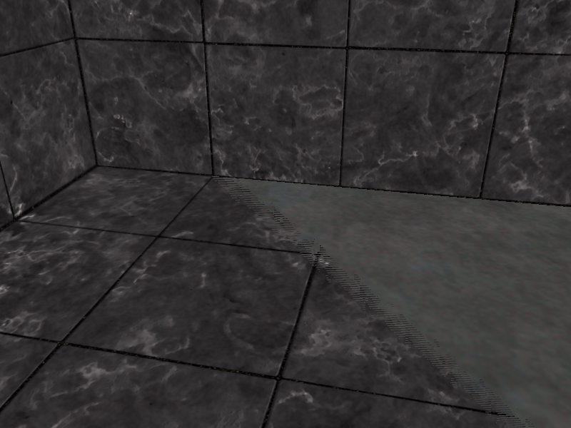

# README

+ 具体使用的 shader 需要自己设置
+ 将 shader 文件名修改为 1.1.vs / 1.1.fs

## shader 作用

+ 1.1.depth_testing.vs / 1.1.depth_testing.fs ：深度测试
    + 进入箱子内部可以看到**深度冲突**的现象

+ 1.1.depth_testing.vs / 1.1.visualization.fs ：深度可视化（z-buffer）
    + 非线性变换：基本全为白色（参见 OpenGL 投影矩阵）
        + http://www.songho.ca/opengl/gl_projectionmatrix.html
        + https://banbao991.github.io/2021/01/31/CG/LS/05-1/

+ 1.1.depth_testing.vs / 1.1.visualization2.fs ：深度可视化（z-buffer）
    + 线性变换（投影矩阵深度的逆变换）