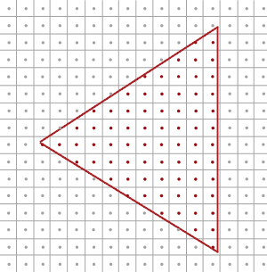

# README

```shell
# 单纯绘制一个立方体
Demo1.exe

# MSAA
Demo2.exe

# offscreen MSAA
# 利用帧缓冲进行 MSAA(glBlitFramebuffer)
Demo3.exe

# 可以读取的缓冲(后处理,和之前的帧缓冲一样)
Demo4.exe
```


+ [learnopengl](https://learnopengl-cn.github.io/04%20Advanced%20OpenGL/11%20Anti%20Aliasing/)


## SSAA

+ 超采样抗锯齿(Super Sample Anti-aliasing)
+ 它会使用比正常分辨率更高的分辨率（即超采样）来渲染场景，当图像输出在帧缓冲中更新时，分辨率会被下采样(Downsample)至正常的分辨率。这些**额外的**分辨率会被用来防止锯齿边缘的产生
+ 虽然它确实能够解决走样的问题，但是由于这样比平时要绘制更多的片段，它也会带来很大的性能开销。所以这项技术只拥有了短暂的辉煌。


## MSAA

+ 多重采样(Multi Sampling Anti-Aliasing)
+ 光栅器是位于最终处理过的顶点之后到片段着色器之前所经过的所有的算法与过程的总和
    + 光栅器会将一个图元的所有顶点作为输入，并将它转换为一系列的片段
    + 顶点坐标理论上可以取任意值，但片段不行，因为它们受限于你窗口的分辨率
    + 顶点坐标与片段之间几乎永远也不会有一对一的映射，所以光栅器必须以某种方式来决定每个顶点最终所在的片段/屏幕坐标



+ 显示效果
    + 由于屏幕像素总量的限制，有些边缘的像素能够被渲染出来，而有些则不会
    + 结果就是我们使用了不光滑的边缘来渲染图元，导致之前讨论到的锯齿边缘


+ 多重采样所做的正是将单一的采样点变为多个采样点（这也是它名称的由来）。我们不再使用像素中心的单一采样点，取而代之的是以特定图案排列的4个子采样点(Subsample)。我们将用这些子采样点来决定像素的遮盖度。当然，这也意味着颜色缓冲的大小会随着子采样点的增加而增加


+ 上图的左侧展示了正常情况下判定三角形是否遮盖的方式。在例子中的这个像素上不会运行片段着色器（所以它会保持空白）。因为它的采样点并未被三角形所覆盖。上图的右侧展示的是实施多重采样之后的版本，每个像素包含有4个采样点。这里，只有两个采样点遮盖住了三角形
+ **采样点的数量可以是任意的，更多的采样点能带来更精确的遮盖率**
+ 从这里开始多重采样就变得有趣起来了。我们知道三角形只遮盖了2个子采样点，所以下一步是决定这个像素的颜色。你的猜想可能是，我们对每个被遮盖住的子采样点运行一次片段着色器，最后将每个像素所有子采样点的颜色平均一下。在这个例子中，我们需要在两个子采样点上对被插值的顶点数据运行两次片段着色器，并将结果的颜色储存在这些采样点中。（幸运的是）这并**不是**它工作的方式，因为这本质上说还是需要运行更多次的片段着色器，会显著地降低性能
+ MSAA真正的工作方式是，无论三角形遮盖了多少个子采样点，（每个图元中）每个像素只运行**一次**片段着色器。片段着色器所使用的顶点数据会插值到每个像素的**中心**，所得到的结果颜色会被储存在每个被遮盖住的子采样点中。当颜色缓冲的子样本被图元的所有颜色填满时，所有的这些颜色将会在每个像素内部平均化。因为上图的4个采样点中只有2个被遮盖住了，这个像素的颜色将会是三角形颜色与其他两个采样点的颜色（在这里是无色）的平均值，最终形成一种淡蓝色


+ 这里，每个像素包含4个子采样点（不相关的采样点都没有标注），蓝色的采样点被三角形所遮盖，而灰色的则没有。对于三角形的内部的像素，片段着色器只会运行一次，颜色输出会被存储到全部的4个子样本中。而在三角形的边缘，并不是所有的子采样点都被遮盖，所以片段着色器的结果将只会储存到部分的子样本中。根据被遮盖的子样本的数量，最终的像素颜色将由三角形的颜色与其它子样本中所储存的颜色来决定。

+ 简单来说，一个像素中如果有更多的采样点被三角形遮盖，那么这个像素的颜色就会更接近于三角形的颜色。如果我们给上面的三角形填充颜色，就能得到以下的效果


+ 对于每个像素来说，越少的子采样点被三角形所覆盖，那么它受到三角形的影响就越小。三角形的不平滑边缘被稍浅的颜色所包围后，从远处观察时就会显得更加平滑了。
+ 不仅仅是颜色值会受到多重采样的影响，深度和模板测试也能够使用多个采样点。对深度测试来说，每个顶点的深度值会在运行深度测试之前被插值到各个子样本中。对模板测试来说，我们对每个子样本，而不是每个像素，存储一个模板值。当然，这也意味着深度和模板缓冲的大小会乘以子采样点的个数。
+ 我们到目前为止讨论的都是多重采样抗锯齿的背后原理，光栅器背后的实际逻辑比目前讨论的要复杂，但你现在应该已经可以理解多重采样抗锯齿的大体概念和逻辑了
+ https://www.zhihu.com/question/20236638/answer/14438218


## 自定义抗锯齿算法

+ 将一个多重采样的纹理图像不进行还原直接传入着色器也是可行的
+ GLSL提供了这样的选项，让我们能够对纹理图像的每个子样本进行采样，所以我们可以创建我们自己的抗锯齿算法
+ 在大型的图形应用中通常都会这么做

+ 要想获取每个子样本的颜色值
    + 你需要将纹理uniform采样器设置为sampler2DMS，而不是平常使用的sampler2D

```cpp
uniform sampler2DMS screenTextureMS;
```

+ 使用texelFetch函数就能够获取每个子样本的颜色值了

```cpp
vec4 colorSample = texelFetch(screenTextureMS, TexCoords, 3);  // 第4个子样本
```