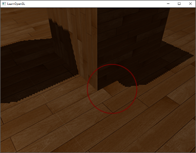
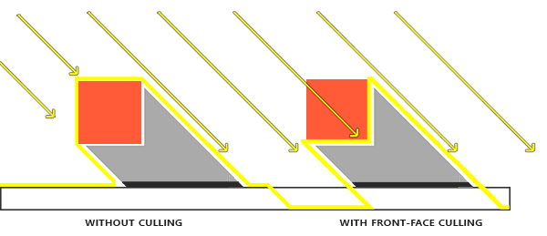

# README

+ 纹理文件 wood.png 在如下文件夹中
    + 05-AdvancedLighting/01-BlinnPhong

```shell
# 没有阴影
Demo1.exe

# 展示阴影缓冲 shadow map
# 正交投影
Demo2.exe

# 展示阴影缓冲 shadow map
# 透视投影
Demo3.exe

# shadow map 阴影算法
# 采样精度低导致有黑白相间的条纹
# 透视投影如果没有包含整个场景深度纹理会出问题
Demo4.exe

# 解决 shadow acne 失真问题
# bias = 0.005f
# 写死, 极端情况可能出问题
Demo4.exe shadowMap_shadowAcne.vs shadowMap_shadowAcne.fs
# bias = 0.005f - 0.05f
# 根据光线和法线夹角动态调整
Demo4.exe shadowMap_shadowAcne2.vs shadowMap_shadowAcne2.fs

# 由于 bias 引发了悬浮问题
# 不使用 bias, 利用面剔除解决 shadow acne 问题
Demo5.exe

# 透视锥太小导致的问题, 无法覆盖整个渲染画面
# 深度纹理图太小
Demo6.exe

# 远处始终可见, 视锥体外始终可见, 深度纹理取消 REPEAT
Demo7.exe farAllSee.vs farAllSee.fs
Demo7.exe

# PCF 减少阴影锯齿
Demo7.exe PCFBlur.vs PCFBlur.fs
```


## Demo4 存在的失真问题（黑白条纹）


+ 阴影失真(Shadow Acne)
+ 因为阴影贴图受限于分辨率，在距离光源比较远的情况下，多个片段可能从深度贴图的同一个值中去采样。图片每个斜坡代表深度贴图一个单独的纹理像素。你可以看到，多个片段从同一个深度值进行采样。
+ 虽然很多时候没问题，但是当光源以一个角度朝向表面的时候就会出问题，这种情况下深度贴图也是从一个角度下进行渲染的。多个片段就会从同一个斜坡的深度纹理像素中采样，有些在地板上面，有些在地板下面；这样我们所得到的阴影就有了差异。因为这个，有些片段被认为是在阴影之中，有些不在，由此产生了图片中的条纹样式。
+ 我们可以用一个叫做**阴影偏移**（shadow bias）的技巧来解决这个问题，我们简单的对表面的深度（或深度贴图）应用一个偏移量，这样片段就不会被错误地认为在表面之下了


```cpp
float bias = 0.005f;
```


+ 这样子当角度太大的时候还是或有失真问题
    + 法线和光线夹角太大
+ 运行如下命令，让光源旋转，在小方块侧壁上还有时能看到黑白条带

```shell
Demo4.exe shadowMap_shadowAcne.vs shadowMap_shadowAcne.fs
```

+ 相对比较好的解决方案
    + 根据法线和光线夹角来给定 bias

```cpp
float bias = max(0.05 * (1.0 - dot(normal, lightDir)), 0.005f);
```


## bias 引发的悬浮问题

+ 悬浮(Peter Panning)
    + 因为物体看起来轻轻悬浮在表面之上
+ 使用阴影偏移的一个缺点是你对物体的实际深度应用了平移。偏移有可能足够大，以至于可以看出阴影相对实际物体位置的偏移，你可以从下图看到这个现象（这是一个夸张的偏移值）



+ 我们可以使用一个技巧解决大部分的Peter panning问题
    + 当渲染深度贴图时候使用正面剔除（front face culling）你也许记得在面剔除教程中OpenGL默认是背面剔除。我们要告诉OpenGL我们要剔除正面
    + 因为我们只需要深度贴图的深度值，对于实体物体无论我们用它们的正面还是背面都没问题。使用背面深度不会有错误，因为阴影在物体内部有错误我们也看不见
+ 这十分有效地解决了peter panning的问题，**但只对内部不会对外开口的实体物体有效**。我们的场景中，在立方体上工作的很好，但在地板上无效，因为正面剔除完全移除了地板。地面是一个单独的平面，不会被完全剔除。如果有人打算使用这个技巧解决peter panning必须考虑到只有剔除物体的正面才有意义。
+ 另一个要考虑到的地方是接近阴影的物体仍然会出现不正确的效果。必须考虑到何时使用正面剔除对物体才有意义。不过使用普通的偏移值通常就能避免peter panning。



+ 为什么能解决问题呢？
    + 使用面剔除后不需要设定 bias 了（相当于加大了深度）
    + 不设定 bias 自然就没有了悬浮问题
    + 对于地板，地板的绘制不能剔除正向面，不然就没了
        + 其实是 OK 的, 因为地板下面已经没有东西了（剔除了地板没有影响的）
        + 但是从地板往上看会发现能看见上面的物体（理论上是看不到的，有些问题）
            + 但是使用偏移量的方法也是没法解决这个问题，因为让地板始终可见了
        + 一个解决方案，把地板绘制成长方体（哈哈哈）


### 采样过多

+ 之前在透视投影中遇到的问题
    + 透视锥太小，覆盖不了整个场景
        + 之前是通过调整地板大小（变小），调整视锥大小（角度调大），调整光源位置（调远）解决的
+ 问题展示

```shell
Demo6.exe
```

+ 一些问题
    + 深度纹理太小，设置成了  **GL_REPEAT** 之后导致外围纹理都不是原来的真实纹理了
+ 解决方案

```cpp
glTexParameteri(GL_TEXTURE_2D, GL_TEXTURE_WRAP_S, GL_CLAMP_TO_BORDER);
glTexParameteri(GL_TEXTURE_2D, GL_TEXTURE_WRAP_T, GL_CLAMP_TO_BORDER);
GLfloat borderColor[] = { 1.0, 1.0, 1.0, 1.0 };
glTexParameterfv(GL_TEXTURE_2D, GL_TEXTURE_BORDER_COLOR, borderColor);
```

+ 将边缘以外部分都设置为可见
    + 我们宁可让所有超出深度贴图的坐标的深度范围是1.0，这样超出的坐标将永远不在阴影之中
+ 仍有一部分是黑暗区域。那里的坐标超出了光的视锥的远平面
    + 在 shader 中判断（z大于远平面则设置为可见）
        + 只要投影向量的z坐标大于1.0，我们就把shadow的值强制设为0.0
+ 这些结果意味着，只有在深度贴图范围以内的被投影的fragment坐标才有阴影，所以任何超出范围的都将会没有阴影。由于在游戏中通常这只发生在远处，就会比我们之前的那个明显的黑色区域效果更真实。


## PCF

+ 阴影现在已经附着到场景中了，不过这仍不是我们想要的
+ 如果你放大看阴影，阴影映射对分辨率的依赖很快变得很明显
    + **锯齿**
    + 因为深度贴图有一个固定的分辨率，多个片段对应于一个纹理像素。结果就是多个片段会从深度贴图的同一个深度值进行采样，这几个片段便得到的是同一个阴影，这就会产生锯齿边

+ 你可以通过**增加深度贴图的分辨率**的方式来降低锯齿块，也可以尝试尽可能的让**光的视锥接近场景**

+ 另一个（并不完整的）解决方案叫做PCF（percentage-closer filtering），这是一种多个不同过滤方式的组合，它产生柔和阴影，使它们出现更少的锯齿块和硬边。核心思想是从深度贴图中多次采样，每一次采样的纹理坐标都稍有不同。每个独立的样本可能在也可能不再阴影中。所有的次生结果接着结合在一起，进行平均化，我们就得到了柔和阴影。

+ 一个简单的PCF的实现是简单的从纹理像素四周对深度贴图采样，然后把结果平均起来：

```
float shadow = 0.0;
vec2 texelSize = 1.0 / textureSize(shadowMap, 0);
for(int x = -1; x <= 1; ++x)
{
    for(int y = -1; y <= 1; ++y)
    {
        float pcfDepth = texture(shadowMap, projCoords.xy + vec2(x, y) * texelSize).r;
        shadow += currentDepth - bias > pcfDepth ? 1.0 : 0.0;
    }
}
shadow /= 9.0;
```

+ 这个textureSize返回一个给定采样器纹理的0级mipmap的vec2类型的宽和高。用1除以它返回一个单独纹理像素的大小，我们用以对纹理坐标进行偏移，确保每个新样本，来自不同的深度值。这里我们采样得到9个值，它们在投影坐标的x和y值的周围，为阴影阻挡进行测试，并最终通过样本的总数目将结果平均化。

+ 使用**更多的样本**，更改texelSize变量，你就可以增加阴影的柔和程度

+ 从稍微远一点的距离看去，阴影效果好多了，也不那么生硬了。如果你放大，仍会看到阴影贴图分辨率的不真实感，但通常对于大多数应用来说效果已经很好了