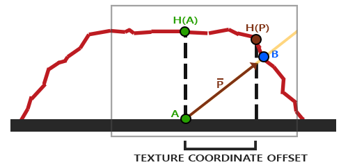
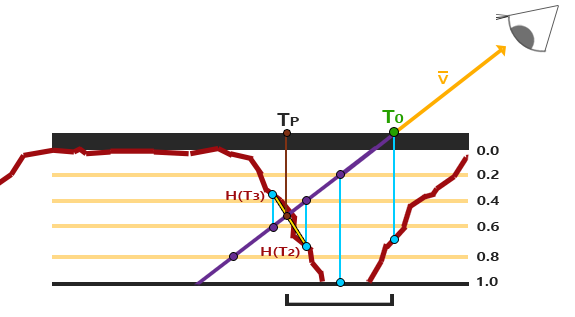

# README

```shell
# 注意得同时开启 normal mapping 和 parallax mapping 才能看到真正视差贴图的效果
# (代码问题)
# 简单的视差贴图
Demo.exe
Demo.exe PM.vs PM.fs

# 换一张贴图
# 倾斜着看会发现纹理有问题(少了一块)
Demo.exe PM.vs PM.fs wood.png toy_box_normal.png toy_box_disp.png

# Steep Parallax Mapping 陡峭视差贴图
# 陡峭处纹理也正常
# 细看会有一些断层
Demo.exe SPM.vs SPM.fs wood.png toy_box_normal.png toy_box_disp.png

# 展示断层问题
# height_scale = 1.0f
Demo.exe SPM2.vs SPM2.fs wood.png toy_box_normal.png toy_box_disp.png

# 视差遮蔽映射
# 加了个线性插值
Demo.exe POM.vs POM.fs wood.png toy_box_normal.png toy_box_disp.png
# height_scale = 1.0f
Demo.exe POM2.vs POM2.fs wood.png toy_box_normal.png toy_box_disp.png
```


## 视差贴图原理

+ 视差贴图(Parallax Mapping)
+ 利用了视错觉，然而对深度有着更好的表达
+ 视差贴图和光照无关
+ 视差贴图属于位移贴图(Displacement Mapping)技术的一种，它对根据储存在纹理中的几何信息对顶点进行位移或偏移


### 置换顶点

+ 一种实现的方式是比如有1000个顶点，根据纹理中的数据对平面特定区域的顶点的高度进行位移
+  置换顶点有一个问题就是平面必须由很多顶点组成才能获得具有真实感的效果，否则看起来效果并不会很好。一个平坦的表面上有1000个顶点计算量太大了。我们能否不用这么多的顶点就能取得相似的效果呢？事实上，上面的表面就是用6个顶点渲染出来的（两个三角形）。上面的那个表面使用视差贴图技术渲染，位移贴图技术不需要额外的顶点数据来表达深度，它像法线贴图一样采用一种聪明的手段欺骗用户的眼睛。


### 视差贴图

+ 视差贴图背后的思想是修改纹理坐标使一个fragment的表面看起来比实际的更高或者更低，所有这些都根据观察方向和高度贴图
+ 视差贴图尝试通过对从fragment到观察者的方向向量进行缩放的方式解决这个问题，缩放的大小是处fragment的高度。所以我们将的长度缩放为高度贴图在点处采样得来的值
+ 下图展示了经缩放得到的向量



+ 我们随后选出以及这个向量与平面对齐的坐标作为纹理坐标的偏移量
+ 这能工作是因为向量是使用从高度贴图得到的高度值计算出来的，所以一个fragment的高度越高位移的量越大
+ 这个技巧在大多数时候都没问题，但点是粗略估算得到的。当表面的高度变化很快的时候，看起来就不会真实，因为向量最终不会和接近，就像下图这样


+ 视差贴图的另一个问题是，当表面被任意旋转以后很难指出从获取哪一个坐标。我们在视差贴图中使用了另一个坐标空间，这个空间向量的x和y元素总是与纹理表面对齐。如果你看了法线贴图教程，你也许猜到了，我们实现它的方法，是的，我们还是在切线空间中实现视差贴图
+ 将fragment到观察者的向量转换到切线空间中，经变换的向量的x和y元素将于表面的切线和副切线向量对齐。由于切线和副切线向量与表面纹理坐标的方向相同，我们可以用的x和y元素作为纹理坐标的偏移量，这样就不用考虑表面的方向了

+ 一般使用的是深度贴图（反高度贴图）


+ 位移贴图是在像素着色器中实现的，因为三角形表面的所有位移效果都不同


## 陡峭视差贴图


+ 分层步进
+ 我们从上到下遍历深度层，我们把每个深度层和储存在深度贴图中的它的深度值进行对比。如果这个层的深度值小于深度贴图的值，就意味着这一层的向量部分在表面之下。我们继续这个处理过程直到有一层的深度高于储存在深度贴图中的值：这个点就在（经过位移的）表面下方。
+ 注意这是个**深度图**
+ 陡峭视差贴图同样有自己的问题。因为这个技术是基于有限的样本数量的，我们会遇到锯齿效果以及图层之间有明显的断层
    + **动态调整**
+ 两种最流行的解决方法叫做Relief Parallax Mapping和Parallax Occlusion Mapping
    + Relief Parallax Mapping更精确一些，但是比Parallax Occlusion Mapping性能开销更多
    + 因为Parallax Occlusion Mapping的效果和前者差不多但是效率更高，因此这种方式更经常使用


##  视差遮蔽映射

+ Parallax Occlusion Mapping
+ 加了个线性插值
    + 陡峭视差贴图用的是 T3
    + 视差遮蔽映射用的是 Tp

