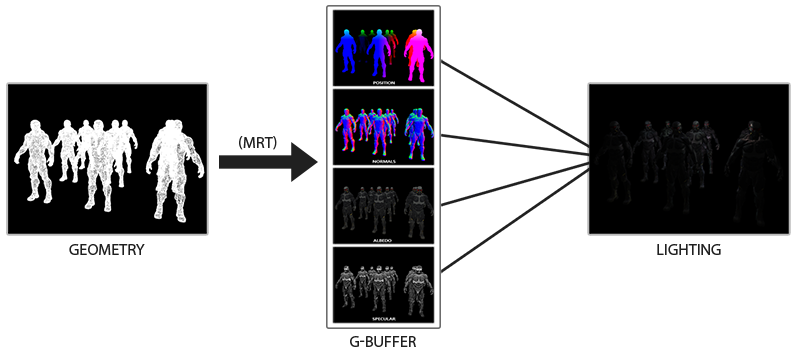

# README

+ 纹理文件 nanosuit(模型) 在如下文件夹中
    + 03-ModelLoading\01-nanosuit


```shell
Demo1.exe

# shader 中加入了半径判断
Demo2.exe
```


## 正向渲染

+ 我们现在一直使用的光照方式叫做**正向渲染(Forward Rendering)**或者**正向着色法(Forward Shading)**，它是我们渲染物体的一种非常直接的方式
+ 在场景中我们根据所有光源照亮一个物体，之后再渲染下一个物体，以此类推
+ 它非常容易理解，也很容易实现，但是同时它对程序性能的影响也很大，因为对于每一个需要渲染的物体，程序都要对每一个光源每一个需要渲染的片段进行迭代，这是**非常**多的
+ 因为大部分片段着色器的输出都会被之后的输出覆盖，正向渲染还会在场景中因为高深的复杂度(多个物体重合在一个像素上)浪费大量的片段着色器运行时间


## 延迟着色

+ **延迟着色法(Deferred Shading)**，**或者说是延迟渲染(Deferred Rendering)**，为了解决上述问题而诞生了，它大幅度地改变了我们渲染物体的方式
+ 这给我们优化拥有大量光源的场景提供了很多的选择，因为它能够在渲染上百甚至上千光源的同时还能够保持能让人接受的帧率
+ 延迟着色法基于我们**延迟(Defer)**或**推迟(Postpone)**大部分计算量非常大的渲染(像是光照)到后期进行处理的想法
+ 它包含两个处理阶段(Pass)
+ 在第一个几何处理阶段(Geometry Pass)中，我们先渲染场景一次，之后获取对象的各种几何信息，并储存在一系列叫做G缓冲(G-buffer)的纹理中；想想位置向量(Position Vector)、颜色向量(Color Vector)、法向量(Normal Vector)和/或镜面值(Specular Value)。场景中这些储存在G缓冲中的几何信息将会在之后用来做(更复杂的)光照计算
+ 我们会在第二个光照处理阶段(Lighting Pass)中使用G缓冲内的纹理数据。在光照处理阶段中，我们渲染一个屏幕大小的方形，并使用G缓冲中的几何数据对每一个片段计算场景的光照；在每个像素中我们都会对G缓冲进行迭代。我们对于渲染过程进行解耦，将它高级的片段处理挪到后期进行，而不是直接将每个对象从顶点着色器带到片段着色器。光照计算过程还是和我们以前一样，但是现在我们需要从对应的G缓冲而不是顶点着色器(和一些uniform变量)那里获取输入变量了

 

+ 这种渲染方法一个很大的好处就是能保证在G缓冲中的片段和在屏幕上呈现的像素所包含的片段信息是一样的，因为深度测试已经最终将这里的片段信息作为最顶层的片段
+ 这样保证了对于在光照处理阶段中处理的每一个像素都只处理一次，所以我们能够省下很多无用的渲染调用
+ 除此之外，延迟渲染还允许我们做更多的优化，从而渲染更多的光源。
+ 当然这种方法也带来几个缺陷， 由于G缓冲要求我们在纹理颜色缓冲中存储相对比较大的场景数据，这会消耗比较多的显存，尤其是类似位置向量之类的需要高精度的场景数据
+ 另外一个缺点就是他不支持混色(因为我们只有最前面的片段信息)， 因此也不能使用MSAA了
+ 在几何处理阶段中填充G缓冲非常高效，因为我们直接储存像素位置，颜色或者是法线等对象信息到帧缓冲中，而这几乎不会消耗处理时间
+ 在此基础上使用多渲染目标(Multiple Render Targets, MRT)技术，我们甚至可以在一个渲染处理之内完成这所有的工作


## G缓冲

+ G缓冲(G-buffer)是对所有用来储存光照相关的数据，并在最后的光照处理阶段中使用的所有纹理的总称
+ 趁此机会，让我们顺便复习一下在正向渲染中照亮一个片段所需要的所有数据
    + 一个3D**位置**向量来计算(插值)片段位置变量供`lightDir`和`viewDir`使用
    + 一个RGB漫反射**颜色**向量，也就是反照率(Albedo)
    + 一个3D**法**向量来判断平面的斜率
    + 一个镜面强度(Specular Intensity)浮点值
    + 所有光源的位置和颜色向量
    + 玩家或者观察者的位置向量


## 延迟着色步骤

+ 几何处理阶段：渲染所有的几何/颜色数据到G缓冲
    + MRT（**Multiple Render Targets**）
+ 光照处理阶段：使用G缓冲计算场景的光照


## 延迟渲染的好处

### 光体积

+ 延迟渲染一直被称赞的原因就是它能够渲染大量的光源而不消耗大量的性能
+ 然而，延迟渲染它本身并不能支持非常大量的光源，因为我们仍然必须要对场景中每一个光源计算每一个片段的光照分量
+ 真正让大量光源成为可能的是我们能够对延迟渲染管线引用的一个非常棒的优化：**光体积(Light Volumes)**
+ 通常情况下，当我们渲染一个复杂光照场景下的片段着色器时，我们会计算场景中**每一个**光源的贡献，不管它们离这个片段有多远
    + 很大一部分的光源根本就不会到达这个片段，可以不计算
    + 隐藏在光体积背后的想法就是计算光源的半径，或是体积，也就是光能够到达片段的范围
    + 由于大部分光源都使用了某种形式的衰减(Attenuation)，我们可以用它来计算光源能够到达的最大路程，或者说是半径
    + 我们接下来只需要对那些在一个或多个光体积内的片段进行繁重的光照运算就行了
    + 这可以给我们省下来很可观的计算量，因为我们现在只在需要的情况下计算光照
+ 为了获取一个光源的体积半径，我们需要解一个对于一个我们认为是**黑暗(Dark)**的亮度(Brightness)的衰减方程，它可以是0.0，或者是更亮一点的但仍被认为黑暗的值，像是0.03
    + 我们现在想要在等于0的前提下解这个方程，也就是说光在该距离完全是黑暗的
    + 然而这个方程永远不会真正等于0.0，所以它没有解
    + 所以，我们不会求表达式等于0.0时候的解，相反我们会求当亮度值靠近于0.0的解，这时候它还是能被看做是黑暗的
    + 5/256=0.01953125
    + 除以256是因为默认的8-bit帧缓冲可以每个分量显示这么多强度值(Intensity)
+ 衰退方程

$$
F_{light}=\dfrac{I}{K_c+K_l\ast d+K_q\ast d^2}
$$

+ 解方程

$$
\dfrac{5}{256}=\dfrac{I_{max}}{Attenuation}=\dfrac{I_{max}}{K_c+K_l\ast d+K_q\ast d^2}
$$

$$
K_q\ast d^2+K_l\ast d+K_c−I_{max}\ast \dfrac{256}{5}=0
$$

$$
d=\dfrac{-K_l+\sqrt{K_l^2-4\ast K_q\ast(K_c−I_{max}\ast \dfrac{256}{5})}}{2K_q}
$$

+ 对于场景中每一个光源，我们都计算它的半径，并仅在片段在光源的体积内部时才计算该光源的光照
    + 注意这种方法仅仅用作教学目的，在实际场景中是不可行的
    + GPU和GLSL并不擅长优化循环和分支
        + 这一缺陷的原因是GPU中着色器的运行是高度并行的，大部分的架构要求对于一个大的线程集合，GPU需要对它运行完全一样的着色器代码从而获得高效率
        + 这通常意味着一个着色器运行时总是执行一个if语句**所有的**分支从而保证着色器运行都是一样的，这使得我们之前的**半径检测**优化完全变得无用，我们仍然在对所有光源计算光照
+ **使用光体积更好的方法是渲染一个实际的球体，并根据光体积的半径缩放。这些球的中心放置在光源的位置，由于它是根据光体积半径缩放的，这个球体正好覆盖了光的可视体积**
    + 我们原来渲染的是整个平面，现在渲染球体
+ 这就是我们的技巧：我们使用大体相同的延迟片段着色器来渲染球体
    + 因为球体产生了完全匹配于受影响像素的着色器调用，我们只渲染了受影响的像素而跳过其它的像素
+ 它被应用在场景中每个光源上，并且所得的片段相加混合在一起。这个结果和之前场景是一样的，但这一次只渲染对于光源相关的片段。它有效地减少了从`nr_objects * nr_lights`到`nr_objects + nr_lights`的计算量，这使得多光源场景的渲染变得无比高效。这正是为什么延迟渲染非常适合渲染很大数量光源。
+ 然而这个方法仍然有一个问题
    + 面剔除(Face Culling)需要被启用(否则我们会渲染一个光效果两次)，并且在它启用的时候用户可能进入一个光源的光体积，然而这样之后这个体积就不再被渲染了(由于背面剔除)，这会使得光源的影响消失。这个问题可以通过一个模板缓冲技巧来解决。
+ 渲染光体积确实会带来沉重的性能负担，虽然它通常比普通的延迟渲染更快，这仍然不是最好的优化
+ 另外两个基于延迟渲染的更流行(并且更高效)的拓展叫做**延迟光照(Deferred Lighting)**和**切片式延迟着色法(Tile-based Deferred Shading)**
+ 这些方法会很大程度上提高大量光源渲染的效率，并且也能允许一个相对高效的多重采样抗锯齿(MSAA)