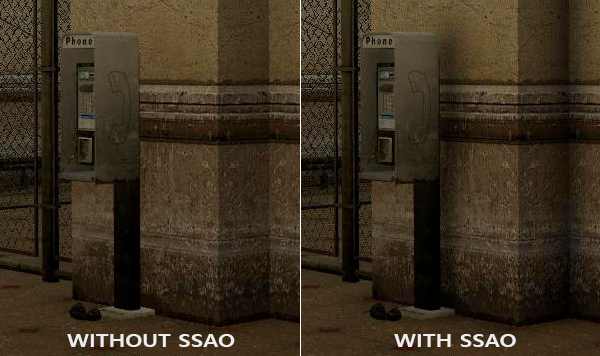
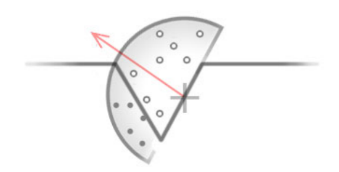

# README

+ 纹理文件 nanosuit(模型) 在如下文件夹中
    + 03-ModelLoading\01-nanosuit

+ 环境光照(Ambient Lighting)
+ 环境光照是我们加入场景总体光照中的一个固定光照常量，它被用来模拟光的**散射(Scattering)**
+ 在现实中，光线会以任意方向散射，它的强度是会一直改变的，所以间接被照到的那部分场景也应该有变化的强度，而不是一成不变的环境光
+ 其中一种间接光照的模拟叫做**环境光遮蔽(Ambient Occlusion)**，它的原理是通过将褶皱、孔洞和非常靠近的墙面变暗的方法近似模拟出间接光照。这些区域很大程度上是被周围的几何体遮蔽的，光线会很难流失，所以这些地方看起来会更暗一些

+ 环境光遮蔽这一技术会带来很大的性能开销，因为它还需要考虑周围的几何体

+ 我们可以对空间中每一点发射大量光线来确定其遮蔽量，但是这在实时运算中会很快变成大问题

## SSAO

+ Screen-Space Ambient Occlusion
+ 屏幕空间环境光遮蔽
+ 这一技术使用了屏幕空间场景的**深度**而不是真实的几何体数据来确定遮蔽量
+ 这一做法相对于真正的环境光遮蔽不但速度快，而且还能获得很好的效果，使得它成为近似实时环境光遮蔽的标准
+ SSAO的原理很简单
    + 对于铺屏四边形(Screen-filled Quad)上的每一个片段，我们都会根据周边深度值计算一个**遮蔽因子(Occlusion Factor)**
    + 这个遮蔽因子之后会被用来减少或者抵消片段的环境光照分量
    + 遮蔽因子是通过采集片段周围球型核心(Kernel)的多个深度样本，并和当前片段深度值对比而得到的
    + 高于片段深度值样本的个数就是我们想要的遮蔽因子

+ 上图中在几何体内灰色的深度样本都是高于片段深度值的，他们会增加遮蔽因子
    + 几何体内样本个数越多，片段获得的环境光照也就越少
+ 渲染效果的质量和精度与我们采样的样本数量有直接关系

+ 因为使用的采样核心是一个球体，它导致平整的墙面也会显得灰蒙蒙的，因为核心中一半的样本都会在墙这个几何体上
+ 由于这个原因，我们将不会使用球体的采样核心，而使用一个沿着表面法向量的半球体采样核心
    + **确实这样更加合理**

## SSAO 的样本缓冲

+ SSAO需要获取几何体的信息，因为我们需要一些方式来确定一个片段的遮蔽因子
+ 对于每一个片段，我们将需要这些数据：
    - 逐片段**位置**向量
    - 逐片段的**法线**向量
    - 逐片段的**反射颜色**
    - **采样核心**
    - 用来旋转采样核心的随机旋转矢量

+ 通过使用一个逐片段观察空间位置，我们可以将一个采样半球核心对准片段的观察空间表面法线
    + 对于每一个核心样本我们会采样线性深度纹理来比较结果
    + 采样核心会根据旋转矢量稍微偏转一点
    + 我们所获得的遮蔽因子将会之后用来限制最终的环境光照分量

 

## Why range check?

+ 这里的黑色部分挡不住光

